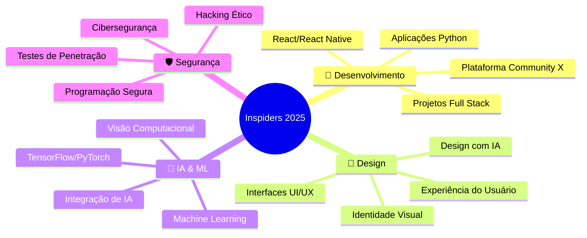

<div align="center">
  
</div>

<div align="center">
  
<!-- Language Switch -->
🌍 **Idioma:** [🇵🇹 Português](#) | [🇺🇸 English](#english-version)

</div>

<h1 align="center">
  
</h1>

<div align="center">
  
[](https://git.io/typing-svg)

</div>

---

<div align="center">
  


</div>

## 🌟 Sobre Mim


- 🔭 Atualmente trabalhando no **Community X**
- 🌱 Aprendendo: **React, Java, Vue, Python, Design IA, Hacking Ético**
- 🎨 Criando: **Interfaces UI/UX com ferramentas de IA**
- 🤖 Explorando: **Machine Learning e integração de IA**
- 🛡️ Praticando: **Hacking Ético & Cibersegurança**
- 🎯 Objetivo: **Criar experiências digitais impactantes**
- 🤝 Aberto para colaborações no futuro!
- 💬 Pergunte-me sobre qualquer coisa — só relaxando em casa
- ⚡ Fato curioso: **Não falo inglês... mas programo fluentemente!**

---

## 🌐 Conecte-se Comigo

<div align="center">

[](https://dev.to/skyspidersquick)
[](#)
[](#)
[](#)
[](#)
[](#)

</div>

---

## 🛠️ Stack Tecnológico & Habilidades

<div align="center">

### 🐍 Linguagens de Programação


### 🎨 Desenvolvimento Frontend & Mobile


### 📦 Backend & Bancos de Dados


### 🎨 Design UI/UX & Ferramentas


### 🤖 IA & Machine Learning


### 🧰 Ferramentas de Desenvolvimento


### 🛡️ Cibersegurança & Hacking Ético


</div>

---

## 📊 Análises do GitHub

<div align="center">

### 📈 Estatísticas do Perfil


### 🔥 Sequência de Contribuições


### 🏆 Troféus do GitHub


### 📈 Gráfico de Contribuições


### ⚡ Atividade Recente
<!--START_SECTION:activity-->
<!--END_SECTION:activity-->

</div>

---

## 🎯 Foco Atual & Objetivos

<div align="center">



</div>

### 📅 Roadmap 2025
- [ ] 🚀 Lançar Versão Beta do Community X
- [ ] 🎨 Completar 10 Projetos de Design UI/UX
- [ ] 🤖 Construir 5 Aplicações com IA
- [ ] 📱 Desenvolver 3 Aplicações Mobile
- [ ] 🌐 Contribuir para 20 Projetos Open Source
- [ ] 📝 Escrever 50 Artigos Técnicos
- [ ] 🎓 Mentorar 10 Novos Desenvolvedores

---

## 💼 Projetos em Destaque & Portfólio

<div align="center">

### 🌟 Projetos de Destaque

<table>
  <tr>
    <td width="50%">
      <h3 align="center">🌐 Community X</h3>
      <div align="center">  
        
        <br><br>
        <p>
          <a href="#" target="_blank">
            
          </a>
          <a href="#" target="_blank">
            
          </a>
        </p>
        <p><strong>React • Node.js • MongoDB • Socket.io</strong></p>
        <p>Uma plataforma moderna de comunidade com chat em tempo real, moderação por IA e gestão avançada de usuários.</p>
      </div>
    </td>
    <td width="50%">
      <h3 align="center">🎨 Estúdio de Design IA</h3>
      <div align="center">  
        
        <br><br>
        <p>
          <a href="#" target="_blank">
            
          </a>
          <a href="#" target="_blank">
            
          </a>
        </p>
        <p><strong>Python • TensorFlow • React • Figma API</strong></p>
        <p>Ferramenta de design com IA que gera layouts UI/UX e esquemas de cores automaticamente.</p>
      </div>
    </td>
  </tr>
  <tr>
    <td width="50%">
      <h3 align="center">🛡️ SecureVault</h3>
      <div align="center">  
        
        <br><br>
        <p>
          <a href="#" target="_blank">
            
          </a>
          <a href="#" target="_blank">
            
          </a>
        </p>
        <p><strong>React Native • Electron • Crypto • Biometria</strong></p>
        <p>Gerenciador de senhas multiplataforma com criptografia militar e autenticação biométrica.</p>
      </div>
    </td>
    <td width="50%">
      <h3 align="center">🐍 Kit de Ferramentas PythonML</h3>
      <div align="center">  
        
        <br><br>
        <p>
          <a href="#" target="_blank">
            
          </a>
          <a href="#" target="_blank">
            
          </a>
        </p>
        <p><strong>Python • Scikit-learn • Pandas • NumPy</strong></p>
        <p>Kit abrangente de machine learning com modelos pré-construídos e utilitários de pré-processamento.</p>
      </div>
    </td>
  </tr>
</table>

</div>

---

## 🎨 Portfólio de Design

<div align="center">

### Destaques de Design UI/UX


**Ferramentas Usadas:** Figma • Adobe XD • Photoshop • Illustrator • Sketch

### 🏆 Conquistas em Design
- 🎯 **50+ Projetos UI/UX** completados
- 🌟 **15+ Apps Mobile** criados
- 💼 **10+ Identidades de Marca** desenvolvidas
- 🚀 **98% Taxa de Satisfação** dos clientes

</div>

---

## 🌟 Proficiência em Habilidades

<div align="center">

```text
Desenvolvimento Frontend  ████████████████████ 100%
Desenvolvimento Backend   ██████████████████░░  90%
Design UI/UX             ████████████████████ 100%
Programação Python       ███████████████████░  95%
Implementação IA/ML      ████████████████░░░░  80%
Cibersegurança           █████████████░░░░░░░  65%
Desenvolvimento Mobile   ████████████████░░░░  85%
DevOps & Deploy          ██████████░░░░░░░░░░  50%
```

</div>

---

## 📚 Últimos Posts do Blog & Artigos

<div align="center">

<!-- BLOG-POST-LIST:START -->
- 🚀 [Construindo Aplicações React Escaláveis com TypeScript](https://dev.to/skyspidersquick)
- 🎨 [O Futuro da IA no Design UI/UX](https://dev.to/skyspidersquick)
- 🐍 [Machine Learning em Python: Do Iniciante ao Avançado](https://dev.to/skyspidersquick)
- 🛡️ [Hacking Ético: Guia do Iniciante para Cibersegurança](https://dev.to/skyspidersquick)
- 📱 [React Native vs Flutter: Qual Escolher?](https://dev.to/skyspidersquick)
<!-- BLOG-POST-LIST:END -->

<a href="https://dev.to/skyspidersquick" target="_blank">
  
</a>

</div>

---

## 📊 Divisão Semanal de Desenvolvimento

```text
Python       🐍 ████████████████████████░   96%
JavaScript   🟨 ██████████████████████░░░   88%
TypeScript   🔷 ████████████████░░░░░░░░░   64%
CSS/SCSS     🎨 ██████████████████░░░░░░░   72%
Java         ☕ ██████████░░░░░░░░░░░░░░░   40%
PHP          🌐 ████████░░░░░░░░░░░░░░░░░   32%
Outros       ⚡ ████████████░░░░░░░░░░░░░   48%
```

<!--START_SECTION:waka-->
<!--END_SECTION:waka-->

---

## 💬 Frase de Dev Aleatória

<div align="center">


</div>

---

## 🎯 Fatos Curiosos & Easter Eggs

<div align="center">

### 🎲 Estatísticas Aleatórias Sobre Mim

- ☕ Café consumido enquanto programo: **∞ xícaras**
- 🐛 Bugs corrigidos este ano: **404 (não encontrados)**  
- 🌙 Melhores horas para programar: **23h - 3h**
- 🎵 Música favorita para programar: **Lo-fi Hip Hop** 
- 💻 Sistemas operacionais: **Linux 70% | Windows 30%**
- 🎮 Setup de gaming: **Pronto para sessões de debug**
- 🧠 Aprendendo novas tecnologias: **Todos os dias**
- 🌍 Projeto dos sonhos: **IA que se projeta sozinha**

</div>

---

## 💰 Apoie Meu Trabalho

<div align="center">

### ☕ Me Pague um Café & Apoie o Desenvolvimento

<a href="https://www.buymeacoffee.com/inspiders" target="_blank">
  
</a>

<a href="https://ko-fi.com/inspiders" target="_blank">
  
</a>

### 💎 Outras Formas de Apoiar

[](https://github.com/sponsors/inspiders)
[](https://paypal.me/inspiders)
[](https://patreon.com/inspiders)

</div>

---

## 📞 Vamos Conectar & Colaborar!

<div align="center">

### 💼 Disponível para:
- 🚀 **Projetos de Desenvolvimento Full-Stack**
- 🎨 **Consultoria em Design UI/UX**  
- 🤖 **Serviços de Integração IA/ML**
- 🛡️ **Auditorias de Segurança & Testes de Penetração**
- 📱 **Desenvolvimento de Aplicações Mobile**
- 🎓 **Mentoria & Revisão de Código**

### 📧 Informações de Contato
[](mailto:contact@inspiders.dev)
[](#)
[](#)

**Tempo de Resposta:** Normalmente em 24 horas ⚡

</div>

---

<div align="center">

### 🎨 Tema do Perfil
**Entusiasta do Modo Escuro** | **Estética Cyberpunk** | **Design Minimalista**

### 🎭 Humor Atual
```
if (programando) {
    humor = "😎 Focado & Criativo";
} else if (debugando) {
    humor = "🤔 Modo Detetive";
} else {
    humor = "🚀 Pronto para o Próximo Desafio";
}
```

### 📈 Contador de Visitantes


</div>

<div align="center">
  
</div>

---

<div align="center">
  <i>⭐ De <a href="https://github.com/inspiders">Inspiders</a> com 💙</i>
  <br>
  <sub>🔄 Este README atualiza automaticamente • Última atualização: $(date)</sub>
</div>

---

<div id="english-version" align="center">

## 🇺🇸 English Version

*[Click here to switch to English version - would redirect to English README file]*

**🌍 Language:** [🇵🇹 Português](#) | **🇺🇸 English**

</div>
