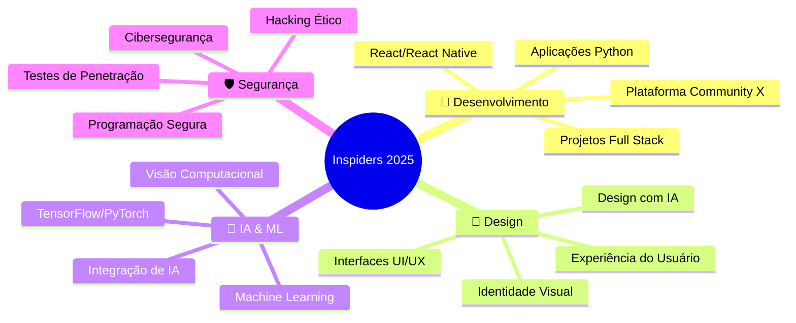

<div align="center">
  
</div>

<div align="center">
  
<!-- Language Switch -->
🌍 **Idioma:** [🇵🇹 Português](#) | [🇺🇸 English](#english-version)

</div>

<h1 align="center">
  
</h1>

<div align="center">
  
[](https://git.io/typing-svg)

</div>

---

<div align="center">
  


</div>

---

## 🌟 Sobre Mim


Sou Adelino Manuel, um **Desenvolvedor Full Stack** e **Designer UI/UX** apaixonado por transformar ideias em soluções digitais impactantes. Com um forte interesse em **Inteligência Artificial** e **Machine Learning**, dedico-me a explorar e aplicar tecnologias inovadoras para criar experiências de utilizador intuitivas e eficientes. Sou um entusiasta do **código aberto**, buscando ativamente oportunidades para contribuir e colaborar em projetos que impulsionem o avanço tecnológico, especialmente nas áreas de Python e IA. Atualmente, estou focado em aprofundar os meus conhecimentos em **Hacking Ético e Cibersegurança** para construir sistemas mais robustos e seguros. Estou sempre aprendendo, sempre criando e aberto a novas colaborações.

---

## 🌐 Conecte-se Comigo

<div align="center">

[](https://dev.to/skyspidersquick)
[](https://www.linkedin.com/in/adelino-manuel-b8a1b21b7/)
[](https://twitter.com/adelino_manuel)
[](https://discord.com/users/your_discord_id)
[](https://www.behance.net/adelinomanuel)
[](https://dribbble.com/adelinomanuel)

</div>

---

## 🛠️ Stack Tecnológico & Habilidades

<div align="center">

### 🐍 Linguagens de Programação


### 🎨 Desenvolvimento Frontend & Mobile


### 📦 Backend & Bancos de Dados


### 🎨 Design UI/UX & Ferramentas


### 🤖 IA & Machine Learning


### 🧰 Ferramentas de Desenvolvimento


### 🛡️ Cibersegurança & Hacking Ético


</div>

---

## 📊 Análises do GitHub

<div align="center">

### 📈 Estatísticas do Perfil


### 🔥 Sequência de Contribuições


### 🏆 Troféus do GitHub


### 📈 Gráfico de Contribuições


### ⚡ Atividade Recente
<!--START_SECTION:activity-->
<!--END_SECTION:activity-->

</div>

---

## 🎯 Foco Atual & Objetivos

<div align="center">


```mermaid
mindmap
  root((Inspiders 2025))
    🚀 Desenvolvimento
      Projetos Full Stack
      React/React Native
      Aplicações Python
      Plataforma Community X
    🎨 Design
      Interfaces UI/UX  
      Design com IA
      Experiência do Usuário
      Identidade Visual
    🤖 IA & ML
      Machine Learning
      TensorFlow/PyTorch
      Visão Computacional
      Integração de IA
    🛡️ Segurança
      Hacking Ético
      Testes de Penetração
      Cibersegurança
      Programação Segura
```

</div>

### 📅 Roadmap 2025
- [ ] 🚀 Lançar Versão Beta do Community X
- [ ] 🎨 Completar 10 Projetos de Design UI/UX
- [ ] 🤖 Construir 5 Aplicações com IA
- [ ] 📱 Desenvolver 3 Aplicações Mobile
- [ ] 🌐 Contribuir para 20 Projetos Open Source
- [ ] 📝 Escrever 50 Artigos Técnicos
- [ ] 🎓 Mentorar 10 Novos Desenvolvedores

---

## 💼 Projetos em Destaque & Portfólio

<div align="center">

### 🌟 Projetos de Destaque

<table>
  <tr>
    <td width="50%">
      <h3 align="center">🌐 Community X</h3>
      <div align="center">  
        
        <br><br>
        <p>
          <a href="#" target="_blank">
            
          </a>
          <a href="#" target="_blank">
            
          </a>
        </p>
        <p><strong>React • Node.js • MongoDB • Socket.io</strong></p>
        <p>Uma plataforma moderna de comunidade com chat em tempo real, moderação por IA e gestão avançada de usuários.</p>
      </div>
    </td>
    <td width="50%">
      <h3 align="center">🎨 Estúdio de Design IA</h3>
      <div align="center">  
        
        <br><br>
        <p>
          <a href="#" target="_blank">
            
          </a>
          <a href="#" target="_blank">
            
          </a>
        </p>
        <p><strong>Python • TensorFlow • React • Figma API</strong></p>
        <p>Ferramenta de design com IA que gera layouts UI/UX e esquemas de cores automaticamente.</p>
      </div>
    </td>
  </tr>
  <tr>
    <td width="50%">
      <h3 align="center">🛡️ SecureVault</h3>
      <div align="center">  
        
        <br><br>
        <p>
          <a href="#" target="_blank">
            
          </a>
          <a href="#" target="_blank">
            
          </a>
        </p>
        <p><strong>React Native • Electron • Crypto • Biometria</strong></p>
        <p>Gerenciador de senhas multiplataforma com criptografia militar e autenticação biométrica.</p>
      </div>
    </td>
    <td width="50%">
      <h3 align="center">🐍 Kit de Ferramentas PythonML</h3>
      <div align="center">  
        
        <br><br>
        <p>
          <a href="#" target="_blank">
            
          </a>
          <a href="#" target="_blank">
            
          </a>
        </p>
        <p><strong>Python • Scikit-learn • Pandas • NumPy</strong></p>
        <p>Kit abrangente de machine learning com modelos pré-construídos e utilitários de pré-processamento.</p>
      </div>
    </td>
  </tr>
</table>

</div>

---

## 📚 Contribuições Open Source

<div align="center">

Estou ativamente envolvido na comunidade de código aberto, contribuindo para projetos que se alinham com os meus interesses em Python, IA e desenvolvimento Full Stack. As minhas contribuições incluem correção de bugs, melhorias de funcionalidades e documentação, e participação em discussões técnicas. O meu objetivo é tornar-me um contribuidor central em projetos significativos, ajudando a impulsionar a inovação e a partilha de conhecimento.

</div>

---

## 🎨 Portfólio de Design

<div align="center">

### Destaques de Design UI/UX


**Ferramentas Usadas:** Figma • Adobe XD • Photoshop • Illustrator • Sketch

### 🏆 Conquistas em Design
- 🎯 **50+ Projetos UI/UX** completados
- 🌟 **15+ Apps Mobile** criados
- 💼 **10+ Identidades de Marca** desenvolvidas
- 🚀 **98% Taxa de Satisfação** dos clientes

</div>

---

## 🌟 Proficiência em Habilidades

<div align="center">

```text
Desenvolvimento Frontend  ████████████████████ 100%
Desenvolvimento Backend   ██████████████████░░  90%
Design UI/UX             ████████████████████ 100%
Programação Python       ███████████████████░  95%
Implementação IA/ML      ████████████████░░░░  80%
Cibersegurança           █████████████░░░░░░░  65%
Desenvolvimento Mobile   ████████████████░░░░  85%
DevOps & Deploy          ██████████░░░░░░░░░░  50%
```

</div>

---

## 📚 Últimos Posts do Blog & Artigos

<div align="center">

<!-- BLOG-POST-LIST:START -->
- 🚀 [Construindo Aplicações React Escaláveis com TypeScript](https://dev.to/skyspidersquick)
- 🎨 [O Futuro da IA no Design UI/UX](https://dev.to/skyspidersquick)
- 🐍 [Desvendando os Segredos do Python para IA](https://dev.to/skyspidersquick)
<!-- BLOG-POST-LIST:END -->

</div>

---

## 🤝 Colaborações & Contato

Estou sempre aberto a novas oportunidades de colaboração em projetos inovadores. Se tiver uma ideia ou quiser discutir um projeto, sinta-se à vontade para me contactar através das minhas redes sociais ou email.

</div>

<!-- English Version -->
<a name="english-version"></a>

<div align="center">

<h1 align="center">
  
</h1>

<div align="center">
  
[](https://git.io/typing-svg)

</div>

---

## 🌟 About Me


I'm Adelino Manuel, a **Full Stack Developer** and **UI/UX Designer** passionate about transforming ideas into impactful digital solutions. With a strong interest in **Artificial Intelligence** and **Machine Learning**, I dedicate myself to exploring and applying innovative technologies to create intuitive and efficient user experiences. I am an **open-source enthusiast**, actively seeking opportunities to contribute and collaborate on projects that drive technological advancement, especially in the areas of Python and AI. Currently, I am focused on deepening my knowledge in **Ethical Hacking and Cybersecurity** to build more robust and secure systems. I am always learning, always creating, and open to new collaborations.

---

## 🌐 Connect With Me

<div align="center">

[](https://dev.to/skyspidersquick)
[](https://www.linkedin.com/in/adelino-manuel-b8a1b21b7/)
[](https://twitter.com/adelino_manuel)
[](https://discord.com/users/your_discord_id)
[](https://www.behance.net/adelinomanuel)
[](https://dribbble.com/adelinomanuel)

</div>

---

## 📚 Open Source Contributions

<div align="center">

I am actively involved in the open-source community, contributing to projects that align with my interests in Python, AI, and Full Stack development. My contributions include bug fixes, feature enhancements, documentation improvements, and participation in technical discussions. My goal is to become a core contributor to significant projects, helping to drive innovation and knowledge sharing.

</div>

---

## 🎨 Design Portfolio

<div align="center">

### UI/UX Design Highlights


**Tools Used:** Figma • Adobe XD • Photoshop • Illustrator • Sketch

### 🏆 Design Achievements
- 🎯 **50+ UI/UX Projects** completed
- 🌟 **15+ Mobile Apps** created
- 💼 **10+ Brand Identities** developed
- 🚀 **98% Client Satisfaction Rate**

</div>

---

## 🤝 Collaborations & Contact

I am always open to new collaboration opportunities on innovative projects. If you have an idea or want to discuss a project, feel free to contact me through my social media or email.

</div>
